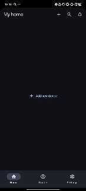

# Smart Home 

[](https://codecov.io/gh/SoftTeco/AndroidBLE)


Application for controlling home automation devices via Bluetooth and ZigBee network.

## Overview
SmartHomeApp enables seamless management of smart home devices such as temperature and humidity sensors (e.g., [LYWSD03MMC](https://www.mi.com/nl/product/mi-temperature-and-humidity-monitor-2/specs/)). It integrates with ZigBee and Bluetooth for secure and efficient device communication. Key features include real-time data monitoring, device management, and a user-friendly interface.

- [Server Setup Documentation for Windows](server_configuration/windows/README.md)
- [Server Setup Documentation for Raspberry Pi](server_configuration/raspberry_pi/README.md)

---

## Core Technologies
- Bluetooth Low Energy (BLE): For direct communication with devices like the LYWSD03MMC.
- ZigBee Protocol: For managing a network of smart home devices.
- MQTT: For reliable message transmission between the app and smart home gateway.
- Jetpack Compose: Modern UI toolkit for building native Android interfaces.
- Compose Navigation: Simplifies navigation between different screens in the app.
- Showing Snackbars with Compose: Provides an easy way to display transient messages.
- Coroutines & Kotlin Flow: For asynchronous programming and reactive streams.
- Android Hilt: For Dependency Injection, improving code modularity and testability.
- Room Database: For local data persistence.
- Unit Testing: Utilizing Mockito & JUnit for ensuring code reliability.
- Retrofit: Simplifies network requests and API integrations.
- Coil: Efficient image loading library for Compose.
- Dark & Light Modes: Support for dynamic theming based on user preferences.
- Detekt: Tool for maintaining consistent code style and identifying potential issues.

---

## Features

### Device Discovery and Pairing
- Automatic discovery of nearby Bluetooth and ZigBee devices.
- Secure pairing using BLE Secure Connections or ZigBee authentication protocols.
- Real-Time Data Monitoring
- Display current temperature and humidity readings.
- Visualize historical data with interactive charts.
- Keeping the connection in the background.

### Device Management
- Display previously connected devices on the Home screen with the current connection status and protocol used. Ability to quickly connect directly from the Home screen.

### Smart Home Integration
- Works seamlessly with ZigBee-enabled hubs.
- Supports multiple devices in a single network.

---

## Getting Started
Follow these steps to build and run SmartHomeApp:

###Prerequisites
Android Studio.
Android device running API 26 (Oreo) or higher with BLE support.

### Installation
1. Clone the Repository
```bash
git clone https://github.com/SoftTeco/AndroidBLE.git
```
2. Open in Android Studio
- Launch Android Studio and open the cloned project.
- Build the Project
- Ensure all dependencies are synced.
- Build the project using the Build > Make Project option.
- Run the App
3. Connect an Android device via USB or use an emulator.
- Run the app using the Run button or Shift + F10.

### Configuration
The app supports the following configurations:
1. ZigBee Gateway
- Ensure the gateway is configured and connected to the same network as the app.
2. Environment Variables
- Configure MQTT credentials for ZigBee communication in the app’s secrets.properties file:
```yaml
BASE_URL= "https\://linkToYourServer"
CODECOV_TOKEN= yourTokenValue
BLUETOOTH_SERVICE_UUID_VALUE = "ebe0ccb0-7a0a-4b0c-8a1a-6ff2997da3a6"
BLUETOOTH_CHARACTERISTIC_UUID_VALUE = "ebe0ccc1-7a0a-4b0c-8a1a-6ff2997da3a6"
BLUETOOTH_DESCRIPTOR_UUID_VALUE = "00002902-0000-1000-8000-00805f9b34fb"
ZIGBEE_SERVER_URL_VALUE = "tcp://smarthome"
```

---

## Working with devices via protocols
- Working with Bluetooth devices is done through the BluetoothHelper interface. It is initialized when MainActivity is created. The variables for its operation are specified above.
- Working with ZigBee devices is done through the ZigBeeHelper interface. It is initialized when MainActivity is created. The variables for its operation are specified above.

---

## Demo


---

## Contributing
Contributions are welcome! If you find any issues or have suggestions for improvements, please open an issue or submit a pull request.

---

## License

This project is licensed under the MIT License. See the [LICENSE](LICENSE) file for details.

Please note that this repository may include third-party libraries or components, which are licensed under their respective licenses. For more information, refer to the license files provided with those components.
