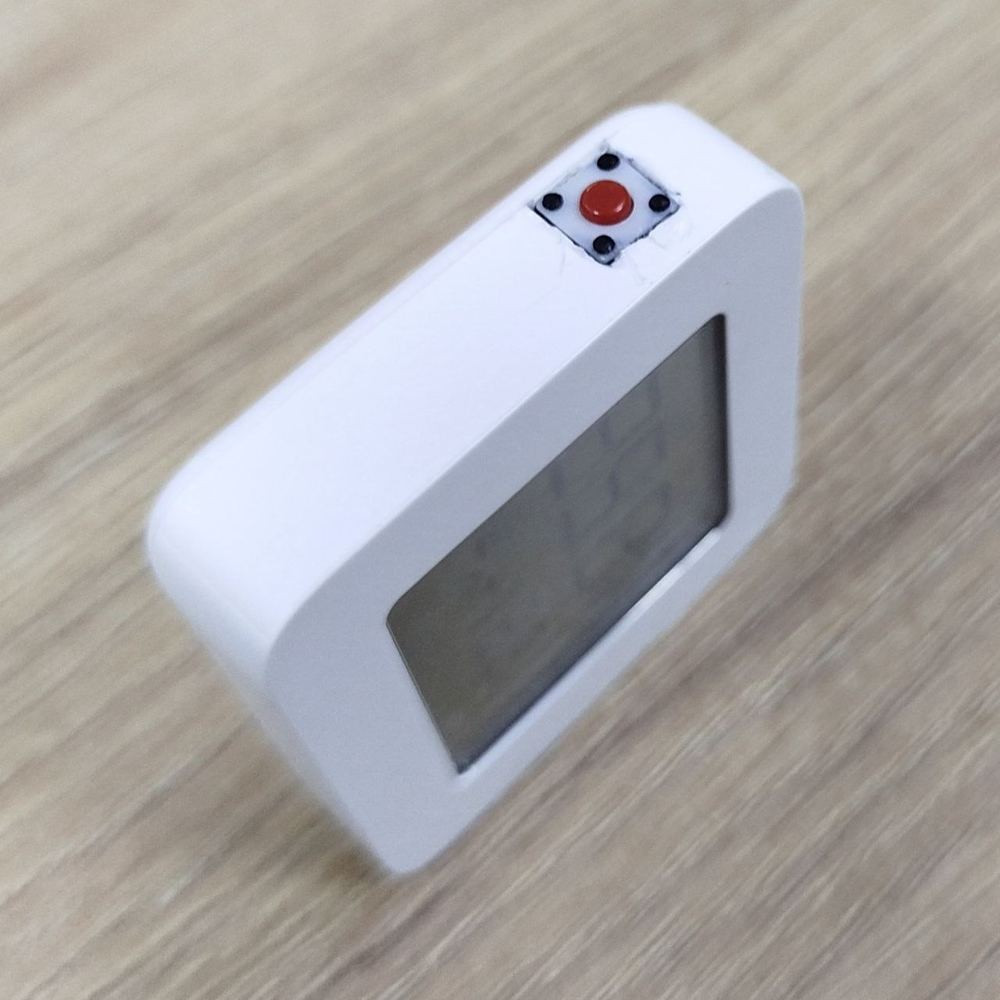
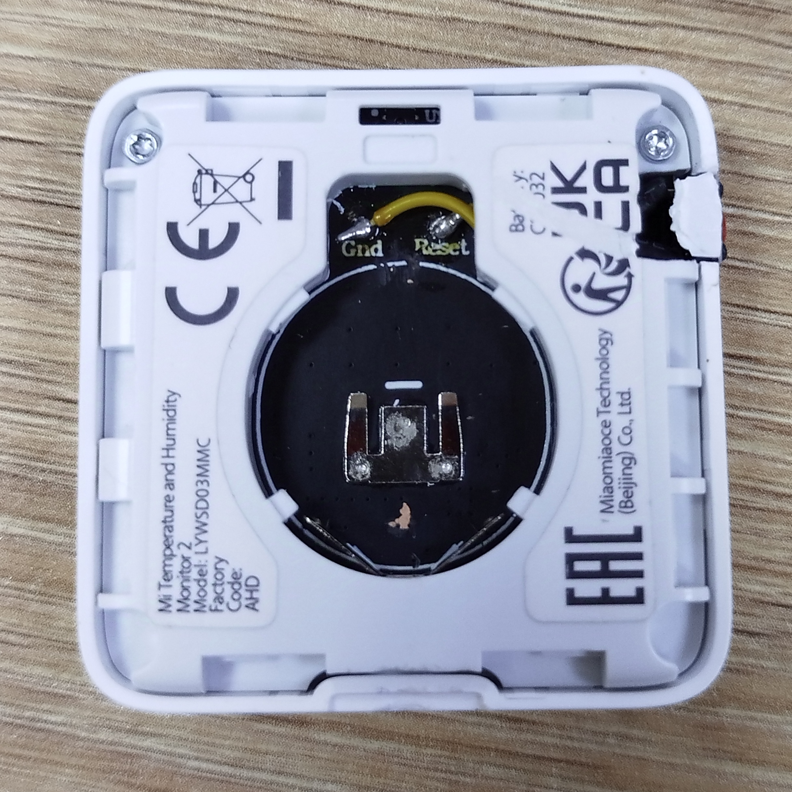

# SmartHomeHub
Code for Windows ZigBee MQTT Server configuration files.

# Zigbee2MQTT Server Setup Guide for Windows

## Overview
Zigbee2MQTT allows you to control Zigbee devices via MQTT, providing a bridge between Zigbee devices and your home automation system. This guide outlines the steps to install and configure Zigbee2MQTT on a Windows system.

---

## Prerequisites
Before proceeding, ensure you have the following:

- A Windows machine (Windows 10 or later).
- A Zigbee USB coordinator (e.g., Sonoff Zigbee 3.0 Dongle Plus or ZBDongle-E).
- Installed **Node.js** (version 16 or later).
- Installed **Python** (version 3.7 or later).
- An MQTT broker (e.g., [Mosquitto](https://mosquitto.org/download/)).

---

## Installation Steps

### 1. Install Required Software

#### Install Node.js
1. Download Node.js from the [official website](https://nodejs.org/).
2. Install Node.js using the installer.
3. Verify the installation by running:
   ```bash
   node -v
   npm -v
   ```

#### Install Python
1. Download Python from the [official website](https://www.python.org/downloads/).
2. During installation, check the box to **Add Python to PATH**.
3. Verify the installation by running:
   ```bash
   python --version
   ```

#### Install Mosquitto (Optional, if no existing broker)
1. Download Mosquitto from the [official website](https://mosquitto.org/download/).
2. Follow the installation instructions.
3. Start the Mosquitto broker by running:
   ```bash
   mosquitto
   ```

### 2. Install Zigbee2MQTT

1. Open a command prompt.
2. Clone the Zigbee2MQTT repository:
   ```bash
   git clone https://github.com/Koenkk/zigbee2mqtt.git
   ```
3. Navigate to the Zigbee2MQTT folder:
   ```bash
   cd zigbee2mqtt
   ```
4. Install dependencies:
   ```bash
   npm ci
   ```

### 3. Configure Zigbee2MQTT

1. Navigate to the `data` folder:
   ```bash
   cd data
   ```
2. Create a `configuration.yaml` file and add the following basic configuration:
   ```yaml
   mqtt:
     base_topic: zigbee2mqtt
     server: mqtt://0.0.0.0
   serial:
     port: //./COM3  # Replace with the COM port of your Zigbee coordinator
   ```
3. Save the file.

### 4. Start Zigbee2MQTT

1. Navigate back to the Zigbee2MQTT root folder:
   ```bash
   cd ..
   ```
2. Start Zigbee2MQTT:
   ```bash
   npm start
   ```
3. Verify that Zigbee2MQTT is running and connected to your MQTT broker.

---

## Common Issues and Troubleshooting

### Zigbee Coordinator Not Detected
- Ensure the correct COM port is specified in `configuration.yaml`.
- Check that the Zigbee coordinator drivers are installed. For Sonoff Dongles, download the driver from [Silicon Labs](https://www.silabs.com/developers/usb-to-uart-bridge-vcp-drivers).

### Zigbee Devices Not Pairing
- Ensure devices are in pairing mode.
- Restart Zigbee2MQTT and try pairing again.
- Reduce the distance between the Zigbee coordinator and the device during pairing.
- Check the `permit_join` setting in `configuration.yaml` to ensure it is enabled during pairing attempts.

### MQTT Connection Issues
- Verify the MQTT broker is running and accessible.
- Check the `server` field in `configuration.yaml` for the correct MQTT broker URL.
- Restart both the MQTT broker and Zigbee2MQTT if issues persist.

### No access to COM port
- Make sure the stick is connected to the computer.
- Check its presence in the Device Manager.
- Check the correctness of the COM port in the configuration.yaml file. If you are using this version of the stick:
  
  
  
  and you cannot reflash it (for example, via [SmartRF Flash Programmer from Texas Instruments](https://www.ti.com/tool/FLASH-PROGRAMMER). Read more about it here: [Reddit conversation](https://www.reddit.com/r/sonoff/comments/x80mda/sonoff_zigbee_30_usb_dongle_plus_unable_to_flash/)), then you must explicitly specify the driver value if your stick does not support a more modern one:
  ```yaml
   serial:
     adapter: ezsp
     port: //./COM3  # Replace with the COM port of your Zigbee coordinator
   ```
- If ping does not work from another device on the local network:

   - Windows Firewall Check: As discussed earlier, the Windows Firewall may block connections, including specific ports for incoming or outgoing traffic.

     Steps to resolve: Ensure port 8080 is open in the firewall settings. Open Control Panel → System and Security → Windows Firewall. Go to Advanced settings on the left panel. In the Inbound Rules section, create a new rule: Select Port. Choose TCP and specify port 8080 (or the port you are using for MQTT). Allow the connection for all network types (private, work, and public). Confirm that the rule is saved and active. If the rule already exists, temporarily disable the Windows Firewall to test:
     ```bash
      netsh advfirewall set allprofiles state off
     ```
     Then verify the connection using telnet.
    
   - Router and NAT Settings Check. If the MQTT broker is running on a device within your network and you’re connecting from another device (e.g., Android via a router), the router might block the port. NAT (port forwarding) might also be needed.

     Steps to resolve: Open your router's settings (usually at 192.168.1.1 or 192.168.0.1). Locate the Port Forwarding or NAT section and add a rule to forward port 8080 to the device running the MQTT broker.
     ```bash
      # Example of port forwarding on a Linux-based router
      iptables -t nat -A PREROUTING -p tcp --dport 8080 -j DNAT --to-destination 192.168.1.100:8080
     ```
     Ensure that the device hosting the broker (e.g., Raspberry Pi or server) does not have restrictions on incoming connections.

   - Verifying Port Availability on the Local Device When connecting to a port on your own computer or server, ensure that port 8080 is being listened to.

      Steps to resolve: On the computer hosting the MQTT broker, open the command prompt and execute:
      ```bash
         netstat -an | grep "8080"
      ```
      This will indicate whether the system is listening on port 8080. If no output is displayed, the broker is not listening on the port. Verify the MQTT broker is running and configured correctly.
     
   - Testing Localhost Connection. Test connecting to the MQTT broker from the same machine using localhost or 127.0.0.1.
   
     Command:
      ```bash
         telnet 127.0.0.1 8080
      ```
      This ensures the broker is operational on the port and eliminates network-related issues.

   - Checking the MQTT Service. If the MQTT broker is not running, no connection will be possible. Ensure the service is active on the intended device. Example for Mosquitto (MQTT broker):

     Check the status of the Mosquitto service:
      ```bash
         systemctl status mosquitto
      ```

      Start the service if it is not running:
      ```bash
         systemctl start mosquitto
      ```

   - Testing a Different Port. If port 8080 is blocked, consider using another port for MQTT (e.g., 8883 for secure MQTT). Verify that the broker is configured for the alternative port.

     Verification:
     ```bash
        telnet 192.168.0.111 8883
     ```

   - Disabling VPN and Antivirus. VPNs or antivirus software may block connections.
   
     Temporarily disable them to test connectivity:
     ```bash
        sudo systemctl stop vpn_service_name
     ```
     or disable antivirus software via its interface.

- If there are problems with communication between the MQTT broker and the server via port (default 1883):

   - Check that the MQTT server is running and listening on port 1883. Ensure the MQTT server (e.g., Mosquitto) is configured correctly and is listening on port 1883.

     What to do: Open the command prompt on the computer hosting the MQTT server and enter the following command:
     ```bash
      netstat -an | find "1883"
     ```
     This command will display whether the server is listening on port 1883. If the port appears, the server is properly configured to work with it.
    
   - Configure the firewall for port 1883. Since port 8080 is already open, you also need to create a rule for port 1883 to allow access to the MQTT server.

     What to do: Open Windows Defender Firewall. Go to Advanced Settings. Create a new rule for Inbound Connections, selecting Port. Choose TCP and specify port 1883. Allow the connection for all network types (Domain, Private, Public). Apply the rule and check if the connection works.

   - Check the MQTT server settings (e.g., Mosquitto). Ensure the MQTT server configuration is set to listen on port 1883.

      What to do: If using Mosquitto, open the configuration file (e.g., mosquitto.conf) and verify the following line:
      ```bash
         listener 1883
      ```
      This line specifies that the server will listen on port 1883. If it’s missing or commented out, add it or uncomment it.
     
   - Ensure no antivirus or other firewalls are blocking the port. Sometimes, antivirus software or other firewalls can block ports, even if Windows Firewall is configured correctly.
   
     What to do: Temporarily disable antivirus or other network filters to check if they are causing the issue. If the connection works after disabling the antivirus, add rules for port 1883 in the antivirus settings.

   - Check router settings. If the MQTT server is behind a router, port 1883 might be blocked at the router level.

     What to do: Open the router’s settings (usually 192.168.0.1 or 192.168.1.1). Verify that no port filtering is enabled to block port 1883. If the server operates on a local network and you’re not using NAT or port forwarding, ensure there are no restrictions on local ports.

   - Use a different port. In some cases, if port 1883 is blocked by the router or ISP, you can try using a different port. For example, you could configure Mosquitto or another server to use port 8883 (for secure SSL/TLS connections) or 8081 as an alternative open port.

     What to do: To change the port in Mosquitto, edit the configuration file:
     ```bash
        listener 8883
     ```
     Restart the server and check the connection on the new port.

   - Allow Anonymous Connections (Temporary for Testing). If you don't want to use authentication or need to test connectivity:
 
     Open mosquitto.conf.
   
     Add or modify the following line:
     ```bash
        allow_anonymous true
     ```
     Restart Mosquitto:
     ```bash
        net stop mosquitto  
        net start mosquitto  
     ```
     Try connecting again with Zigbee2MQTT. If the connection works, the issue was with incorrect credentials. Re-enable authentication and verify the settings.

   - Ensure Mosquitto Accepts Connections on All Interfaces. Configure the server in mosquitto.conf to listen on all interfaces:
       
     Add the following lines to the configuration file:
     ```bash
        listener 1883 0.0.0.0  
        allow_anonymous false  
     ```
     Restart Mosquitto after making these changes.

### General Debugging Tips
- Review the Zigbee2MQTT logs for error messages by running:
  ```bash
  npm start -- -v
  ```
- Ensure no other applications are using the same COM port as the Zigbee coordinator.
- Update Zigbee2MQTT to the latest version by pulling the latest changes from the repository:
  ```bash
  git pull
  npm ci
  ```
- Run Zigbee2MQTT with debug logs for more detailed output:
  ```bash
  npm start -- --log-level debug
  ```
- Add an extra button to reboot the device if you are using LYWSD03MMC:





---

## Additional Resources
- [Zigbee2MQTT Documentation](https://www.zigbee2mqtt.io/)
- [Mosquitto Documentation](https://mosquitto.org/documentation/)
- [Node.js Documentation](https://nodejs.org/en/docs/)

---

## Acknowledgments
This guide is based on the official Zigbee2MQTT setup instructions and adapted for Windows systems.
